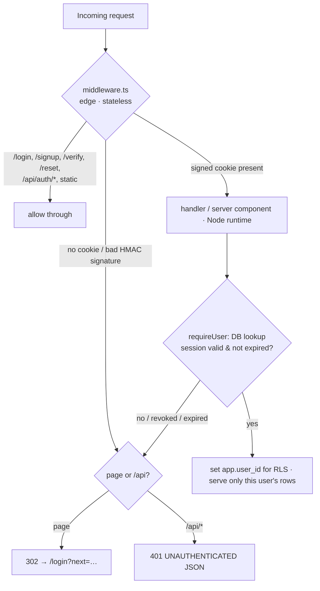
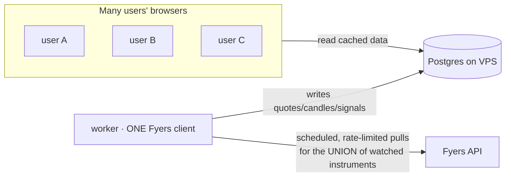
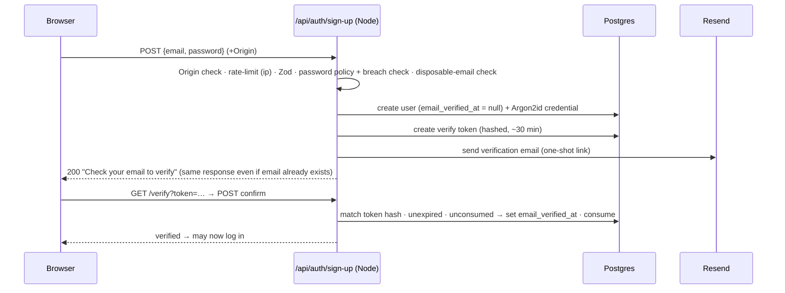

# Authentication — multi-user architecture & implementation plan

Status: **proposal / for review** · Date: 2026-09-06 · Scope: **design only, no auth code written yet**
Supersedes: [`docs/architecture/auth-system-design.md`](../architecture/auth-system-design.md) (the "Better Auth" plan).

> **What this is.** The plan for a **first-party, multi-user** authentication system
> for EquityWise. Every user signs up, logs in, and owns their own data. All
> authentication data — accounts, password hashes, sessions — lives **only on our
> own VPS Postgres**. No external auth product (no Clerk, no Better Auth, no Auth0).
> The one external service is **Resend**, used solely to *send* verification and
> password-reset emails; it never sees a password or session.
>
> **Confirmed decisions (2026-09-06):** ① multi-user product (not single-user);
> ② build the complete multi-user system, not a single-user phase first;
> ③ **passwords only** (no passkeys for now); ④ **Resend** for email;
> ⑤ free `/login` from the Fyers route so user login can use it; ⑥ clean install —
> there is **no legacy auth data to migrate**; ⑦ update all "single-user" wording.

---

## Table of contents

1. [Summary & how we got here](#1-summary--how-we-got-here)
2. [Security requirements & standards](#2-security-requirements--standards)
3. [Target architecture](#3-target-architecture)
4. [Prerequisite work before login (free `/login`; Fyers scaling)](#4-prerequisite-work-before-login)
5. [Authentication flows (diagrams)](#5-authentication-flows)
6. [Database / data model (multi-user)](#6-database--data-model-multi-user)
7. [Per-user data isolation — owner_id + Postgres RLS](#7-per-user-data-isolation)
8. [Data classification — what lives where](#8-data-classification)
9. [Password-storage strategy](#9-password-storage-strategy)
10. [Session / token strategy](#10-session--token-strategy)
11. [Registration + email verification](#11-registration--email-verification)
12. [Login flow](#12-login-flow)
13. [Logout flow](#13-logout-flow)
14. [Password-reset flow](#14-password-reset-flow)
15. [MFA / 2FA (TOTP, optional)](#15-mfa--2fa-totp-optional)
16. [Rate limiting & anti-abuse](#16-rate-limiting--anti-abuse)
17. [Security controls & attack mitigations](#17-security-controls--attack-mitigations)
18. [VPS / server hardening](#18-vps--server-hardening)
19. [Secret & key management](#19-secret--key-management)
20. [Logging & monitoring](#20-logging--monitoring)
21. [Backup & recovery](#21-backup--recovery)
22. [Testing & security-testing strategy](#22-testing--security-testing-strategy)
23. [Privacy & legal (real users = real PII)](#23-privacy--legal)
24. [Clean install (no legacy migration) & deployment checklist](#24-clean-install--deployment-checklist)
25. [Roadmap & final technology choices](#25-roadmap--final-technology-choices)

---

## 1. Summary & how we got here

EquityWise had Clerk removed (commit `a32c3f2`) and is currently **open to the
public internet with no login**. This plan replaces it with a self-built,
multi-user login whose data stays entirely on our VPS.

Two earlier proposals were wrong and are dropped:
- The **Better Auth** plan misread "better authentication" as the product *Better
  Auth* and recommended an external framework. Rejected — we build it ourselves.
- The **single-user gate** framing (an interim version of this doc) is superseded:
  the product is now explicitly **multi-user** (`CLAUDE.md` updated 2026-09-06).

The auth *mechanics* (hashing, sessions, cookies, CSRF) are the same regardless of
user count; what makes this a *multi-user* system is **public self-service
registration, email verification, per-user data isolation, and abuse controls at
scale** — all specified below.

**Validation that self-building is the right call:** Lucia, the most popular JS auth
library, was **deprecated in March 2025**; its author now recommends implementing
sessions from scratch and republished Lucia as a learning resource. Building auth
directly on your own stack is the current mainstream position.

---

## 2. Security requirements & standards

Grounded in **OWASP ASVS 5.0** (2025), **NIST SP 800-63B-4** (final Sept 2024), the
OWASP cheat sheets, and IETF RFCs (6265bis cookies, 6238 TOTP).

**Functional**
1. A visitor can **register** with email + password; the account is inert until the
   email is **verified**.
2. A user can **log in**, **stay logged in** across restarts, and **log out** (and
   "log out of all devices").
3. A user can **reset a forgotten password** by email.
4. Each user sees and edits **only their own** watchlists/data.
5. Optional **TOTP 2FA** per account. **Admin** (you) has an operator view users
   don't.

**Security bar (the standard)**
- **Passwords:** Argon2id, per-user salt, tuned params; verification constant-time;
  never logged. Policy: **≥ 15 characters when password is the only factor** (NIST
  800-63B-4 / ASVS 5.0), or ≥ 8 when TOTP is also enabled; **no** composition rules;
  **no** forced rotation; **allow paste**; **reject breached passwords**.
- **Sessions:** ≥ 256-bit opaque token, stored **hashed**; cookie `HttpOnly; Secure;
  SameSite=Lax; Path=/` with the **`__Host-`** prefix; **new session id on every
  login** (anti-fixation); idle + absolute expiry; revocable server-side.
- **CSRF:** `SameSite` + strict **Origin/Referer** check on state-changing requests;
  auth mutations are POST-only.
- **Account enumeration:** identical response + timing for unknown-email vs
  wrong-password; registration and reset never reveal whether an email exists.
- **Abuse:** per-IP + per-account rate limits, progressive lockout, breached-password
  rejection, disposable-email screening, email-verification gate on new accounts.
- **Isolation:** every user-owned row carries `owner_id`; **Postgres RLS** makes a
  missing filter fail closed.
- **Injection/XSS:** Drizzle parameterises everything; Zod at every boundary; React
  escaping; strict CSP; `HttpOnly` cookie.
- **Secrets:** never in git/bundle; root-owned `.env` `chmod 600`; TOTP seeds
  encrypted at rest with a key held outside the DB.

---

## 3. Target architecture

**One line:** a first-party multi-user auth system on the existing stack (Next.js 15
App Router, Drizzle + `pg`, self-hosted Postgres 17) — Argon2id passwords, opaque
**database-backed sessions** (SHA-256-hashed at rest) in a `__Host-` cookie, a
**two-layer gate** (stateless signed-cookie check in middleware + authoritative DB
check in a Node-runtime `requireUser()`), **public registration with Resend email
verification**, **email password reset**, **per-user isolation via `owner_id` +
Postgres RLS**, Postgres-backed rate limiting, Origin-checked CSRF, optional TOTP
2FA, and an append-only audit log. **All auth data on the VPS.**

### 3.1 Where each piece lives

| Piece | Location |
|---|---|
| Pure logic (password policy, lockout maths, token shape) | `packages/core/src/auth/*` — pure, unit-tested (repo rule) |
| Password hashing | `apps/web/src/server/auth/password.ts` (`@node-rs/argon2`) |
| Sessions + crypto + cookies | `apps/web/src/server/auth/session.ts` |
| `requireUser()` / `requireAdmin()` | `apps/web/src/server/auth/require-user.ts` (Node runtime) |
| Email sending (Resend) | `apps/web/src/server/auth/email.ts` |
| Auth API routes | `apps/web/src/app/api/auth/*/route.ts` (`sign-up`, `sign-in`, `sign-out`, `verify`, `reset/request`, `reset/confirm`, `2fa/*`, `session`) |
| Auth pages | `apps/web/src/app/(auth)/login`, `(auth)/signup`, `(auth)/verify`, `(auth)/reset` |
| Route gate | `apps/web/src/middleware.ts` (stateless) |
| Schema | `packages/db/src/schema/auth.ts` (+ `owner_id` on watchlists) |
| Repositories | `packages/db/src/repositories/auth.ts` (+ scoping in watchlist repos) |
| RLS policies | migration `0013` |
| Cleanup job | `apps/worker/src/jobs/auth-maintenance.ts` |

### 3.2 The two-layer gate



Middleware is fast and stateless (only checks the cookie's HMAC signature — `pg`
can't run on the Edge runtime). `requireUser()` does the authoritative, revocable DB
check on the Node runtime and establishes the per-request user for RLS.

---

## 4. Prerequisite work before login

Two things must be handled **before/alongside** the login, both of which you raised.

### 4.1 Free `/login` from the Fyers route (do this first)

`apps/web/src/app/login/route.ts` currently **is the Fyers OAuth initiator** (it
redirects the browser to Fyers), and `apps/web/src/app/callback/route.ts` is its
redirect target. To use `/login` for **user login**, the Fyers route must move.

**Plan (small, contained):**
- Move `apps/web/src/app/login/route.ts` → **`apps/web/src/app/api/fyers/connect/route.ts`** (the initiator; it's our own route, renaming is free).
- Keep `apps/web/src/app/callback/route.ts` **as-is** for now — it doesn't collide
  with user login, and its path is the **redirect URL registered in the Fyers
  developer dashboard**, so renaming it would require updating that dashboard entry.
  (Optional later: also move it to `/api/fyers/callback` and update the Fyers
  dashboard redirect URL + config.)
- Update the internal references: `callback/route.ts` imports `OAUTH_STATE_COOKIE`
  from the old path and links to `/login`; both get repointed to
  `/api/fyers/connect`.
- **Low risk:** the worker auto-mints the Fyers token daily (`deployment.md §5`);
  this browser handshake is only a manual fallback, so moving it doesn't affect
  normal operation.

Result: `/login` is free for the user login page.

### 4.2 The Fyers single-account bottleneck — the real scaling problem

**This is not an auth problem, and auth cannot fix it — but it will block "many
users" if unaddressed.** The whole app shares **one Fyers account**: single session
per account, a token that expires daily, and strict rate-limits with a circuit
breaker (`deployment.md §5`). If every user's browser pulls live quotes through that
one token, you hit Fyers rate-limit bans quickly.

**Alternative plan — fan-in: users read from our DB, only the worker talks to Fyers.**



- **The worker is the only Fyers client.** It already stores candles and daily
  signals; extend it to refresh the **union of all users' watched instruments**
  (deduplicated) on a schedule during market hours, and write to Postgres.
- **Every user's browser reads from Postgres**, never from Fyers. So Fyers load
  scales with the **number of distinct instruments watched**, not the **number of
  users** — 10 users or 10,000 put the same load on Fyers.
- **Near-real-time UI** comes from the browser polling our DB-backed API (or a
  WebSocket/SSE layer from the DB), not from per-user Fyers calls.
- This matches the existing design (worker writes, web reads) and the open issue
  [serve-daily-signals-from-the-database.md](../../issues/serve-daily-signals-from-the-database.md).

**Sequencing:** this is a **separate workstream** from login. It does **not** block
building auth, but it **must** be solved before real user traffic. It should get its
own plan. Auth ships independently; the two meet at "open the doors to the public."

---

## 5. Authentication flows

### 5.1 Register → verify



### 5.2 Login (with optional 2FA), 5.3 Logout, 5.4 Reset — see §12, §13, §14.

---

## 6. Database / data model (multi-user)

New file `packages/db/src/schema/auth.ts`, migration `0013` (current max `0012`).
Repo conventions: `integer generatedAlwaysAsIdentity()` PKs, snake_case,
`timestamptz`. Built for scale: indexed lookups, cascade deletes, RLS.

### `auth_users`
| Column | Type | Notes |
|---|---|---|
| `id` | integer PK identity | referenced by `owner_id` everywhere |
| `email` | text, **unique (lower-cased)**, not null | identity |
| `email_verified_at` | timestamptz, null | null ⇒ unverified, account inert |
| `display_name` | text, null | |
| `role` | text, not null, default `'user'` | `'user'` \| `'admin'` (minimal, not full RBAC) |
| `status` | text, not null, default `'active'` | `'active'` \| `'disabled'` (admin can disable abusers) |
| `created_at` / `updated_at` | timestamptz | |

### `auth_credentials` (1:1 password store, split so a hash never rides a user read)
| `user_id` PK FK cascade · `password_hash` (Argon2id) · `password_changed_at` · `updated_at` |

### `auth_sessions` (server-side, revocable)
| `id` · `user_id` FK cascade (indexed) · `token_hash` **unique** (SHA-256 of opaque token) · `created_at` · `last_used_at` · `expires_at` (indexed) · `ip_address` · `user_agent` |

### `auth_mfa` (TOTP, optional, 1:1)
| `user_id` PK FK · `totp_secret_enc` bytea (AES-256-GCM, key outside DB) · `enabled_at` null · `recovery_codes` text[] (**hashes**) |

### `auth_tokens` (verification + reset, short-lived, one-shot)
| `id` · `user_id` FK cascade (indexed) · `purpose` (`email_verify` \| `password_reset`) · `token_hash` **unique** · `expires_at` · `consumed_at` null |

### `auth_attempts` (durable rate-limit / lockout — survives deploys)
| `id` · `key` (indexed: `ip:…` or `email:…`) · `window_start` · `failures` · `locked_until` null |

### `auth_audit` (append-only security log; INSERT-only trigger like `0002_guards.sql`)
| `id` · `at` · `event` · `user_id` null FK · `ip_address` · `user_agent` · `detail` jsonb (**redacted** — never a password/token/seed) |

### Change to existing tables — `owner_id`
`watchlists`, `watchlist_views`, and the user-owned rows gain
**`owner_id integer not null references auth_users(id)`**, and the unique indexes
become **per-owner** (e.g. `watchlists_name_idx` → `(owner_id, name)`). Every read/
write already funnels through `repositories/watchlists.ts`, so scoping is one layer.
See §7.

---

## 7. Per-user data isolation

The #1 multi-user requirement: user A must never see user B's data. **Two layers,
defence-in-depth:**

1. **Application scoping.** Every query in the watchlist repositories filters by the
   current `owner_id`. `requireUser()` provides it.
2. **Postgres Row-Level Security (RLS) — the backstop that fails closed.** On every
   user-owned table:
   ```sql
   ALTER TABLE watchlists ENABLE ROW LEVEL SECURITY;
   ALTER TABLE watchlists FORCE ROW LEVEL SECURITY;
   CREATE POLICY owner_isolation ON watchlists
     USING (owner_id = current_setting('app.user_id')::int);
   ```
   Each request sets the user inside a transaction: **`SET LOCAL app.user_id = $1`**
   (not plain `SET` — the web app uses a **session-mode `pg` pool**, and `SET LOCAL`
   is scoped to the transaction so it can't bleed across pooled connections). If
   application code ever forgets a `WHERE owner_id = …`, RLS returns **nothing**
   rather than leaking.

This is **per-user** isolation (individuals own rows), not per-organisation
multi-tenancy. Org/team tenancy is a separate `tenant_id` layer, out of scope.

> Reference/global data (instruments, candles, indicator snapshots) is **shared,
> read-only** and stays un-scoped — it is market data, not user data.

---

## 8. Data classification

**1 — MUST be on the VPS (Postgres `auth_*`):** account (id, email, verified flag,
role, status); **Argon2id hash**; sessions (**hashed** token, expiry, ip, ua);
**encrypted** TOTP seed; **hashed** recovery codes; **hashed** verify/reset tokens;
rate-limit counters; append-only audit; every user's `owner_id`-scoped data.

**2 — MUST NEVER be stored:** plaintext or reversibly-encrypted passwords; the
**raw** session token server-side (only in the cookie); raw verify/reset tokens; an
unencrypted TOTP seed; recovery codes in the clear; any password/token/seed in logs
or `auth_audit.detail`.

**3 — MAY optionally be stored (minimise):** last-login time/IP; user-agent for the
active-sessions view; the user's own login history.

**4 — Secrets, stored SEPARATELY from the DB:** `AUTH_SESSION_SECRET` (cookie HMAC),
`AUTH_ENCRYPTION_KEY` (wraps TOTP seeds), `RESEND_API_KEY`, `DATABASE_URL` — in
root-owned `.env` `chmod 600`, never in git/bundle. (§19)

---

## 9. Password-storage strategy

- **Argon2id** via **`@node-rs/argon2`** (prebuilt binaries; no native toolchain on
  the VPS). Params tuned to ~0.25–0.5 s/hash; start at OWASP 2025 **m = 46 MiB, t =
  1, p = 1** (or 19 MiB/t=2/p=1). Zero-dependency fallback: Node `crypto.scrypt`
  (N=2¹⁷, r=8, p=1).
- Per-user salt embedded in the encoded hash. **Rehash-on-login** if params fall
  below target.
- **Constant-time verify**; on unknown email, verify against a **decoy hash** so
  timing doesn't reveal existence.
- **Policy (NIST 800-63B-4):** **≥ 15 chars** (or ≥ 8 with TOTP enabled), up to 64+,
  allow all Unicode incl. spaces, allow paste, **reject breached passwords**
  (bundled top-100k list, or Pwned Passwords k-anonymity range API — only a 5-char
  hash prefix leaves the server). No composition rules, no forced rotation.

---

## 10. Session / token strategy

- **Opaque, DB-backed sessions** (not JWT) — instantly revocable, cheap on localhost
  Postgres.
- Token = `crypto.randomBytes(32)` (256-bit, base64url). DB stores only
  **`SHA-256(token)`**.
- **Cookie `__Host-session`** = `token.HMAC(token, AUTH_SESSION_SECRET)`, flags
  `HttpOnly; Secure; SameSite=Lax; Path=/`. The HMAC lets middleware reject forged
  cookies with no DB call.
- **New session on every login** (anti-fixation). **Idle** (rolling `last_used_at`,
  e.g. 7 days) + **absolute** (e.g. 30 days) expiry. Sessions older than
  `password_changed_at` are invalid (reset ⇒ logout everywhere). **"Log out all
  devices"** deletes all rows for the user.
- **Cleanup:** worker job reaps expired sessions/tokens and stale attempts.

---

## 11. Registration + email verification

Public self-service, abuse-guarded (this is the multi-user front door):
1. `POST /api/auth/sign-up` — Origin check; **per-IP signup rate limit**; Zod;
   password policy + **breach check**; **disposable-email screening**; lower-case
   email.
2. Create `auth_users` (email_verified_at = null) + Argon2id credential.
3. Issue `auth_tokens{email_verify}` (store hash), **send via Resend** a one-shot
   link (~30 min).
4. **Respond identically whether or not the email already exists** (no enumeration);
   if it exists, optionally email "you already have an account" instead.
5. Account is **inert until verified** — can't log in, owns no data yet. Verifying
   sets `email_verified_at` and consumes the token.
6. Audit `signup` / `email_verified`.

---

## 12. Login flow

`POST /api/auth/sign-in`:
1. **Origin check** (CSRF layer 1).
2. **Rate-limit** `ip:…` and `email:…`; if `locked_until > now()`, generic 429 +
   `Retry-After`.
3. Look up credential by lower-cased email; **always** run Argon2id verify (decoy
   hash if no user) — same timing.
4. **Reject if `email_verified_at` is null** ("verify your email first") or `status
   = 'disabled'`.
5. Fail ⇒ increment failures + lockout maths (pure fn), audit `login_failure`
   (user_id null for unknown email), generic `401`.
6. Success + **2FA on** ⇒ `{mfaRequired, challengeId}`, no session yet; TOTP posted
   to `/api/auth/2fa/verify` creates the session.
7. Success + no 2FA ⇒ create session, set `__Host-session`, reset counter, audit
   `login_success`.

---

## 13. Logout flow

`POST /api/auth/sign-out` (POST + Origin check — never a GET link):
1. Delete the `auth_sessions` row (or all rows for "all devices").
2. Clear the cookie (`Max-Age=0`).
3. Audit `logout`; redirect to `/login`.

---

## 14. Password-reset flow

Email-based (Resend), enumeration-safe:
1. `POST /api/auth/reset/request {email}` → **always** "If that account exists, we've
   sent a reset link." (identical body + timing).
2. If it exists: issue `auth_tokens{password_reset}` (store hash), **Resend** a
   **short-lived (30–60 min), one-shot** link.
3. `POST /api/auth/reset/confirm {token, newPassword}` → verify hash · unexpired ·
   unconsumed; enforce policy + breach check; write new Argon2id hash; set
   `password_changed_at` (⇒ **all sessions invalidated**); consume token; audit
   `password_reset`.

> Each user resets their **own** password to their **own** email, sent through
> Resend. You (owner) configure Resend once; no manual involvement per reset.

---

## 15. MFA / 2FA (TOTP, optional)

Passwords are the primary factor (your call). TOTP is **offered, not required**:
- **TOTP (RFC 6238)**: enrol via QR (`otpauth://`), confirm one code before
  `enabled_at`; store secret **encrypted** (`AUTH_ENCRYPTION_KEY`); accept current
  step ±1; reject replay. **Recovery codes:** 8–10 one-time, shown once, stored
  **hashed**.
- Recommend admin (you) enable it. Passkeys/WebAuthn are a possible future upgrade,
  deliberately **out of scope now** (passwords are enough per decision ③).

---

## 16. Rate limiting & anti-abuse

Public signup changes the threat model — bots and stuffing now target you. Layered,
**durable across deploys**, **no Redis** (rule):
1. **Nginx `limit_req`** on `/api/auth/*`.
2. **Postgres `auth_attempts`** keyed independently by `ip:…` and `email:…`; sliding
   window; the decision is a **pure function** in `packages/core`, unit-tested.
   Progressive: warn → throttle → temporary lockout (exponential backoff).
3. **Signup-specific:** per-IP signup cap, **disposable-email blocklist**,
   **email-verification gate** (unverified accounts can't act), optional
   CAPTCHA/proof-of-work if bot signups appear.
4. **fail2ban** jail on repeated `401`/`429` from `/api/auth/*`.
5. **Credential stuffing** ⇒ the breached-password check (§9) rejects known creds.
6. Every lockout writes `auth_audit{lockout}`.

---

## 17. Security controls & attack mitigations

| Threat | Control |
|---|---|
| Password cracking | Argon2id, tuned, salted, breach rejection (§9) |
| Brute force / stuffing | Layered rate limit + lockout + breach check (§16) |
| Session hijacking | `HttpOnly`+`Secure` cookie, token hashed at rest, idle timeout, active-sessions revoke |
| Session fixation | Fresh session id every login (§10) |
| CSRF | `__Host-` + `SameSite=Lax` + strict Origin check; POST-only mutations |
| **Cross-user data leak** | `owner_id` scoping **+ Postgres RLS fail-closed** (§7) |
| XSS | React escaping, strict CSP, `HttpOnly` cookie, no dynamic `dangerouslySetInnerHTML` |
| SQL injection | Drizzle parameterised; Zod at boundary |
| Account enumeration | Identical body+timing (decoy verify); signup/reset never reveal existence |
| Clickjacking | `frame-ancestors 'none'` + `X-Frame-Options: DENY` |
| Open redirect (`?next=`) | Accept only same-origin, path-only targets |
| Privilege escalation | `role`/`status` checked server-side in `requireAdmin()`; users can't set their own role |

---

## 18. VPS / server hardening

Already in place (`deployment.md`): UFW (22/80/443 only), Postgres localhost-only,
SSH keys-only, fail2ban, unattended-upgrades, Let's Encrypt TLS, `.env` root-owned
`chmod 600`.

**Add for auth:** security headers (HSTS, **strict CSP** — mind the two inline
theme/nav `<script>` constants, use a nonce/hash; `X-Content-Type-Options`,
`X-Frame-Options`, `Referrer-Policy`, `Permissions-Policy`); Nginx `limit_req` on
`/api/auth/*`; fail2ban jail for `/api/auth/*`; cookie `Secure` gated on
`NODE_ENV === 'production'` (dev is http://localhost).

---

## 19. Secret & key management

Three new secrets, ≥32 random bytes where applicable, in root-owned `.env`
(`chmod 600`, gitignored), added to `.env.example` (empty) + runbook:
- `AUTH_SESSION_SECRET` — cookie HMAC key.
- `AUTH_ENCRYPTION_KEY` — AES-256-GCM key wrapping TOTP seeds (so DB-only compromise
  can't read 2FA seeds).
- `RESEND_API_KEY` — Resend send-only key. Add **SPF + DKIM + DMARC** on
  `equitywise.io` (ideally a `mail.` subdomain) for deliverability.

Rotation: rotating `AUTH_SESSION_SECRET` logs everyone out (acceptable); rotating
`AUTH_ENCRYPTION_KEY` needs a re-encrypt migration for stored TOTP seeds. Update the
`.env.example` "web app needs exactly two values" note — it now also needs these.
Optional future hardening: `sops`+`age` or systemd `LoadCredential`.

---

## 20. Logging & monitoring

- **`auth_audit`** (append-only): `login_success/failure`, `logout`, `signup`,
  `email_verified`, `password_reset`, `lockout`, `mfa_enabled`, `session_revoked`,
  `admin_disable_user`. Redacted — never a secret.
- **PM2 logs** get structured, redacted auth lines.
- **Detection:** a worker check warns on a **burst of failures/lockouts** per window
  (attack signal). **Active-sessions view** per user (list + revoke) doubles as
  self-monitoring. Admin view: recent signups, lockouts, disabled accounts.

---

## 21. Backup & recovery

- Existing nightly `pg_dump` + Hostinger backups already cover the new `auth_*`
  tables — no new job.
- Backups now hold password hashes + encrypted TOTP seeds ⇒ **encrypt dumps at rest**
  and keep them off-server (already Hostinger). `AUTH_ENCRYPTION_KEY` lives in
  `.env`, **not** the dump — so **back the key up separately**, or TOTP seeds are
  unrecoverable after a full-box loss.
- Extend `restore-drill.sh` to assert `auth_users`/`auth_sessions` restore.

---

## 22. Testing & security-testing strategy

- **Pure unit (`packages/core`):** password policy, lockout maths, rate-limit
  decision, `next`-param validation — fixture-driven, no I/O.
- **Crypto:** Argon2id round-trip + constant-time; session mint→hash→verify; cookie
  HMAC; AES-GCM TOTP wrap/unwrap; TOTP vs RFC 6238 vectors.
- **Integration (throwaway DB):** signup→verify→login→gated→logout; wrong-password
  lockout; reset invalidates sessions; **RLS: user A cannot read user B's rows**
  (the key multi-user test).
- **Security regression (assert, don't eyeball):** cookie flags `HttpOnly/Secure/
  SameSite/__Host-`; enumeration timing within tolerance; `/api/*` → 401 signed out;
  pages → `/login`; **`/login` is user login, not Fyers** (guard test); Origin-less
  POST rejected; open-redirect rejected; admin route rejects non-admin.
- **Tooling:** `pnpm typecheck/lint/test` + `npm audit` in CI; `/security-review` on
  the auth PR.

---

## 23. Privacy & legal

Real users mean real personal data — new obligations that didn't exist for a
personal tool:
- **Minimise PII:** email + hash + session metadata only; no more than needed.
- **Privacy policy + Terms of Service** shown at signup; **consent** captured.
- **Data export + deletion** on request (cascade delete removes a user's rows via
  `owner_id` FKs).
- **Breach-readiness:** the audit log + monitoring support incident response.
- (India: DPDP-class duties; general: GDPR-class if any EU users.) Not legal advice —
  flag to get a policy in place before public launch.

---

## 24. Clean install & deployment checklist

### 24.1 No legacy migration — clean install
There is **no existing user/auth data to migrate or remove.** Clerk stored accounts
on **its** servers (now deleted); the database has **no user tables today**. So this
is a **fresh, additive install**, not a data migration:
- Migration `0013` **adds** `auth_*` tables + `owner_id` columns + RLS. No drops of
  real data.
- Remove leftover **Clerk env references** from `.env.example` (already mostly gone).
- The Fyers `/login`→`/api/fyers/connect` move (§4.1) is a rename, not a data change.
- The **first admin account** is created through the normal signup, then promoted to
  `role='admin'` by a one-off script (there's no data to import).

### 24.2 Deployment checklist
- [ ] `AUTH_SESSION_SECRET`, `AUTH_ENCRYPTION_KEY`, `RESEND_API_KEY` in VPS `.env`; SPF/DKIM/DMARC set.
- [ ] Migration `0013` reviewed (additive; `auth_audit` insert-only; RLS `FORCE`d).
- [ ] `/login` freed; `/api/fyers/connect` works; Fyers fallback still functions.
- [ ] Nginx: `limit_req` + security headers + fail2ban jail on `/api/auth/*`.
- [ ] Cookies `Secure` + `__Host-` verified over HTTPS.
- [ ] Gate verified: signed-out → `/login` (pages) / `401` (`/api`).
- [ ] **RLS verified: user A cannot read user B's data.**
- [ ] First admin created + promoted; TOTP enrolled; recovery codes stored.
- [ ] Resend verified end-to-end (signup verify + reset email deliver).
- [ ] Worker `auth-maintenance` scheduled; audit emitting; no secret in logs.
- [ ] `/security-review` run on the PR.

---

## 25. Roadmap & final technology choices

### Final technology choices
| Concern | Choice |
|---|---|
| Approach | **First-party, on the existing stack** — no auth library/vendor |
| Password hash | **Argon2id** (`@node-rs/argon2`), scrypt fallback |
| Password policy | **≥15 chars** (≥8 with TOTP), breach-rejected (NIST 800-63B-4) |
| Sessions | Opaque 256-bit, **DB-backed**, SHA-256-hashed, `__Host-` cookie |
| Gate | **Two-layer** (stateless middleware + `requireUser()`) |
| CSRF | SameSite + strict Origin, POST-only mutations |
| **Data isolation** | **`owner_id` + Postgres RLS (fail-closed)** |
| Registration | **Public self-service + email verification** |
| Email | **Resend** (send-only; verify + reset) |
| Password reset | **Email, enumeration-safe** |
| 2FA | **TOTP optional**; passkeys out of scope now |
| Rate limit | Nginx + Postgres counters + fail2ban (no Redis) |
| Roles | Minimal **user / admin** (no full RBAC, no org tenancy) |
| Data | Self-hosted **PG 17**, migration `0013`, all on VPS |

### Build order (one coherent build — not phased into single-user)
1. **Prereq:** free `/login` from Fyers (§4.1).
2. **Schema `0013`:** `auth_*` tables + `owner_id` + RLS + repositories.
3. **Core mechanics:** Argon2id, sessions, cookies, `requireUser()`, middleware gate.
4. **Flows:** signup + Resend verification, login, logout, email reset.
5. **Isolation:** scope watchlist repos by `owner_id`; enforce RLS.
6. **Anti-abuse:** rate limits, lockout, disposable-email, Nginx/fail2ban.
7. **UI:** `/login`, `/signup`, `/verify`, `/reset` pages; header user menu; admin view.
8. **Hardening:** headers, audit, worker cleanup, monitoring.
9. **2FA (TOTP):** optional, enrol admin.
10. **Deploy + verify** (§24.2). **Fyers fan-in (§4.2) lands before public traffic.**

### Still to confirm before coding
- Exact Fyers route name (`/api/fyers/connect` proposed).
- The **Fyers fan-in (§4.2)** gets its own plan — agree it's parallel, not blocking.

---

## References
- OWASP ASVS 5.0; OWASP Cheat Sheets (Authentication, Session Management, Password
  Storage, Forgot Password). NIST SP 800-63B-4. IETF RFC 6265bis, RFC 6238.
- Lucia deprecation (build-your-own validation). Postgres RLS multi-tenancy pattern.
- Internal: `CLAUDE.md` (now multi-user), `docs/operations/deployment.md`,
  `apps/web/src/app/login/route.ts` + `callback/route.ts` (Fyers routes to move),
  `apps/web/src/server/watchlist-routes.ts` (error shape/plumbing to reuse),
  `packages/db/src/schema/watchlists.ts` (the `owner_id` seam),
  `issues/serve-daily-signals-from-the-database.md` (Fyers fan-in).
