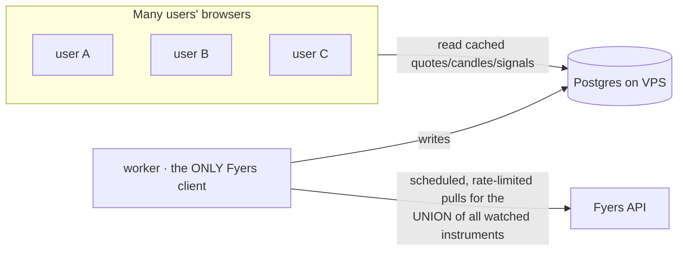

# Market-data scaling — serving many users from one Fyers account

Status: **proposal / for later** · Date: 2026-09-06 · Scope: design only, not started.
Related: [authentication-plan.md](authentication-plan.md) §4.2 · [../operations/deployment.md](../operations/deployment.md) §5 ·
[../../issues/serve-daily-signals-from-the-database.md](../../issues/serve-daily-signals-from-the-database.md)

> Split out of the authentication plan at the owner's request. Authentication does
> **not** depend on this, and this does not depend on authentication — but this
> **must be solved before real user traffic**, because it is the true scaling limit
> of the app. To be done **after** the login system.

---

## 1. The problem

EquityWise gets all market data from **one Fyers account**, and Fyers imposes hard
limits that were fine for a single operator but break under many users
(`deployment.md §5`):

- **One active session per account.** A second login (even the trading app)
  invalidates the token.
- **A token that expires daily** (~07:00 IST); the worker re-mints it.
- **Strict rate limits + a circuit breaker.** A flood of calls trips a ban that can
  escalate to ~1 hour; retrying extends it.

If each user's browser pulls live quotes through that one token, request volume
grows with the **number of users**. A few dozen active users refreshing watchlists
would exhaust the Fyers budget and trip bans — for everyone at once. **No amount of
auth work changes this**; it is a data-plane problem.

---

## 2. The principle: decouple users from Fyers (fan-in)

**Users must never talk to Fyers. Only the worker does. Users read cached data from
our own Postgres.**

The key property: **Fyers load scales with the number of distinct instruments
watched, not the number of users.** 10 users or 10,000 watching the same 200 stocks
put the *same* load on Fyers — because the worker fetches each instrument once and
every user reads the shared result from the DB.

This matches the existing architecture (`apps/worker` writes, `apps/web` reads) and
the single-writer rule — nothing here fights the current design; it extends it.

---

## 3. What to build

1. **Instrument demand set.** Compute the deduplicated union of instruments across
   all users' watchlists (once auth + `owner_id` exist). This is the worker's fetch
   list — bounded by distinct instruments, not users.
2. **Worker refresh loop.** During market hours, the worker refreshes quotes for the
   demand set on a schedule (e.g. every N seconds), respecting the existing Fyers
   rate-limiter/circuit-breaker, and upserts a **latest-quote** row per instrument
   in Postgres. Daily candles/signals already land via the EOD pass.
3. **DB-backed read API.** The web app's quote/watchlist endpoints read the cached
   rows from Postgres — never call Fyers per request. (Reuse the existing read-only
   web→DB path.)
4. **Near-real-time delivery to the browser.** Start with short-interval polling of
   the DB-backed API; upgrade to **SSE/WebSocket** pushing changes from the DB if
   sub-second freshness is needed. No Redis (rule) — Postgres `LISTEN/NOTIFY` or a
   simple poll suffices at this scale.
5. **Freshness + staleness UX.** Show "as of HH:MM:SS"; serve last-good on a Fyers
   ban rather than erroring every user (the existing `canServeStale` pattern).
6. **Fyers entitlement.** Confirm the Fyers plan/API tier permits the aggregate
   volume for the expected instrument count and refresh cadence.

---

## 4. Boundaries & non-goals

- **Still one Fyers account** (single-session): the worker remains the sole client;
  a manual Fyers login still invalidates the token (`deployment.md §5`). Multiple
  Fyers accounts / a paid market-data feed is a separate, later question.
- **No per-user market-data isolation** — quotes/candles are shared reference data,
  not user-owned rows (they stay outside RLS; see authentication-plan §7).
- **Not started until after auth**, and required before opening to real users.

---

## 5. Open questions

1. Refresh cadence vs Fyers budget for the expected instrument count.
2. Polling vs SSE/WebSocket for the first version.
3. Whether a second data provider (the Upstox plan) or a paid feed is needed at the
   target user count — see [upstox-provider-plan.md](upstox-provider-plan.md).
