# Telegram archives and reproducible backtesting

Status: discovery and initial format probe implemented; downloader, pages and run
engine are not implemented. This is the current design against the September 2026
Signals feature. The August backtesting architecture references deleted code and
is retained only as historical context.

The user will provide the Telegram channel name. The runtime choice is still open:
this repository is TypeScript/Node >=24, while the new request specifies Perl.
The proposed integration keeps the existing Next.js application and pure TypeScript
strategy. If Perl is required, it supplies the Arrow ingestion component behind a
versioned process protocol; it does not duplicate the strategy implementation.
No full-history download or backtest is authorized as an initial trial.

## Workflow and boundaries

```mermaid
flowchart LR
  T[Configured Telegram channel] --> C[Paginated file catalog]
  C --> D[Selected resumable downloads]
  D --> V[Checksum and schema validation]
  V --> A[Immutable local archives]
  A --> N[Bounded normalization]
  N --> P[Preflight and selected run manifest]
  P --> R[Isolated historical replay]
  R --> S[Run results and events]
  S --> U[Results page and comparison]
```



The downloader does not calculate signals. The normalizer does not decide strategy
rules. The backtester does not call Telegram or write live signal/paper tables. The
web app enqueues and reads durable jobs; lengthy downloads/replays do not run inside
HTTP handlers. Use PostgreSQL metadata and leases, filesystem bulk data and separate
local worker processes; no Redis/Celery or new hosted service is needed.

“Local” initially means this Mac: files, processing and a dedicated local research
database. Do not use the production database or public website as an implicit bridge
to the Mac's disk. A local-only runtime gate, loopback binding, authenticated owner
checks and same-origin mutation protection cover both pages and every archive API.
Keep Telegram sessions and archive files outside static/public directories. A future
VPS-hosted archive is a separate explicit operational choice.

## 1. Telegram retrieval and file catalog

Use a user-authorized MTProto session for historical channel enumeration. Telegram's
`messages.getHistory` is user-only; a new bot is not a general channel-history reader.
Obtain app credentials and complete interactive login locally. Store the session as
a restricted secret; never return it through web APIs or put it in a run manifest.
The source is configured by the operator and resolved to a stable peer ID. Only the
configured peer is read. The old plan mentions `NFO_DAILY_DATA`, but the current user
will supply the intended name; do not silently connect to the old value.
[Telegram history](https://core.telegram.org/method/messages.getHistory),
[application credentials](https://core.telegram.org/api/obtaining_api_id).

Persist discovery progress before continuing to the next page. Track separate cursors
for new messages and older history. Periodic overlap scans detect edits/replacements;
a deletion or repost never silently changes an existing run's input. “Available” means
messages discoverable by this authorized account, not inaccessible/deleted history.
Use decimal strings for Telegram's large peer/document IDs across JSON boundaries.

The catalog stores source/peer/message/document identity, original filename, media
size, published and edited times, discovered time, media type, local state and error.
A message may refer to an already known document; record another source reference
instead of downloading it again. Unique identities and database leases prevent two
workers from claiming the same artifact. After download, SHA-256 provides byte-level
deduplication across renamed/reposted copies; filename equality is never sufficient.

Download only selected IDs. Stream chunks directly to a same-filesystem `.part`
file; checkpoint validated byte offsets, expected document identity and lease token.
Flush data before advertising durable progress. A restart revalidates the identity
and partial length before resuming. Expired remote file references are refreshed from
the original message. Respect flood-wait delays and retry timestamps without hot loops.
GramJS offers a chunk-yielding `iterDownload` interface if the TypeScript retrieval
adapter is selected; equivalent behavior is required of another MTProto adapter.
[GramJS downloads](https://gram.js.org/beta/classes/TelegramClient.html#iterDownload).

Verify final size, checksum, supported envelope and schema before transitioning to
Ready. Atomic rename precedes the final catalog transaction; restart reconciliation
recovers an object renamed before its DB commit. Failed or cancelled downloads retain
bounded partial data with an explicit resume/restart action. No automatic purge of
source data. Check free disk and impose download/temporary-space budgets first.

Suggested private layout:

```
<archive-root>/
  secrets/telegram-session
  partial/<artifact-id>.part
  objects/sha256/<prefix>/<sha256>.feather
  manifests/<dataset-id>/<revision>.json
  normalized/<normalizer-version>/<input-hash>/<session>/...
  runs/<run-id>/manifest.json
  runs/<run-id>/events/...
  runs/<run-id>/metrics.json
```

Never use a Telegram filename as a filesystem path. For archives, enforce entry-count,
expanded-byte and path limits; reject absolute paths, `..` and symlink entries.
Inspection may require seekable files: stream an archive member to bounded disk before
opening its Feather footer. Extension checks alone are not format validation.

## 2. Feather/Arrow reader decision

| Option | Finding and intended use |
| --- | --- |
| `Glib::Object::Introspection` + native Arrow GLib | Candidate Perl bridge to official native Arrow classes, including mapped input and indexed record-batch reads. Must validate actual typelib signatures, ownership, codec support and repeated-batch RSS with a sample. |
| `FFI::Platypus` + a small native Arrow C ABI shim | Alternative when introspection is inadequate. Explicit native buffer lifetime/error handling is required. These are binding tools, not a turnkey Feather reader. |
| Native Arrow helper process | Can perform bulk decoding/normalization with Arrow C++ and return bounded typed batches or normalized partition references to Perl/Node. Keeps per-row object creation out of Perl where practical. |
| `apache-arrow` JavaScript | Fits the current app if Perl was a wording error. Verify the chosen release, codec registration and actual compressed files. The old statement that an `ARROW1` header guarantees pure-Node compatibility is too strong. |
| `Data::Frame` / PDL | Not selected as a proven Feather ingestion path. Published `Data::Frame` docs describe an experimental data-frame container and CSV serialization, not the required batch reader. |

Feather V2 is Arrow IPC and can contain LZ4 or ZSTD-compressed buffers. V1 is a
different legacy format; Arrow 25 documents its deprecation. Detect versions first,
then pin a compatible reader/converter. Preserve original V1 bytes and conversion
provenance. Do not assume the latest reader will indefinitely support V1.
[Feather specification](https://arrow.apache.org/docs/python/feather.html).

Read selected columns and record batches, not a complete `read_all()`/dataframe.
One compressed batch can itself exceed RAM. Inspect encoded/decompressed size metadata,
set a maximum decoded-batch budget, bound dictionary growth, and fail cleanly before
allocating beyond it where possible. A subprocess memory limit is the final backstop.
Memory mapping avoids unnecessary whole-file copies; it does not eliminate compressed
buffer allocations or make an arbitrarily large batch safe.

The concrete Perl installation here is 5.34.1. Neither candidate Perl binding is
installed. No native reader has been validated against the user's files. The new
`scripts/archive/feather-probe.pl` reads only the file header and tail, reports v1/v2
signatures and footer bounds, and deliberately reports `schema_validated: false`.
It can inspect a multi-gigabyte file without reading its data body. This is a diagnostic
for choosing the reader, not the ingestion mechanism or a memory benchmark for Arrow.

Sources:
- [Perl introspection bindings](https://metacpan.org/pod/Glib::Object::Introspection)
- [Perl FFI::Platypus](https://metacpan.org/dist/FFI-Platypus)
- [Arrow GLib reader classes](https://arrow.apache.org/docs/c_glib/arrow-glib/)
- [Indexed record-batch reads](https://arrow.apache.org/docs/19.0/c_glib/arrow-glib/method.RecordBatchFileReader.read_record_batch.html)
- [Mapped input](https://arrow.apache.org/docs/c_glib/arrow-glib/class.MemoryMappedInputStream.html)
- [Arrow JS compression work](https://github.com/apache/arrow-js/issues/109)
- [Data::Frame](https://metacpan.org/pod/Data::Frame)

## 3. Schema discovery before historical claims

Inspect one selected file for schema, row count, batch sizes, codecs, time range,
market segment, symbols, timestamp units/timezone, price units and volume meaning.
Message publication date and exchange data date are different fields. A text-message
archive does not by itself contain the candles needed for this technical strategy.
Futures/options prices are not interchangeable with NSE cash-equity prices.

A versioned schema mapping must define:

- stable instrument IDs and dated symbol/tick-size/corporate-action mappings;
- event time precision/timezone, optional receipt time, event sequence and ordering;
- paise/rupee/decimal input conversion to exact integer paise, with invalid rows rejected;
- last price or OHLCV, quote bid/ask, cumulative-versus-incremental volume and resets;
- NIFTY index observations and the benchmark's constituent-volume convention;
- overlapping file policy, duplicate event identity, corrupt rows and missing sessions.

Do not infer tick deduplication solely from equal symbol/time/price: legitimate repeated
trades can share those values. Identify source overlap and stable event identity first.
Unsorted files need a bounded external merge sort, with disk limits and stable ordering,
not an in-memory multi-year sort. Preserve sub-millisecond ordering before converting
closed-bar boundaries to the core's timestamp representation.

Normalize to immutable, source-tagged partitions for one-minute candles plus ordered
quote observations needed by fills/spread checks. Derive 5m bars on demand. Cache keys
include all input hashes and normalizer version. Alternate data sources for the same
instrument/time must remain isolated; do not mix them in the live candle table.

## 4. Historical replay and reproducibility

Reuse `evaluateVwapSetup`, `updateSignalStatus` and paper cost/result functions from
`packages/core`. Never rewrite the strategy in Perl. A Perl data component can feed a
bounded protocol into the TypeScript evaluator, with backpressure and cancellation.
Keep one instrument/session window and the documented warm-up prefix in memory;
stream results to disk/DB incrementally. Optimize incremental indicators only after
proving decision equality against the existing batch evaluator.

The archive preflight must establish the inputs needed for each scored session:
250+ complete prior/current 5m bars, full opening range, 20 preceding daily-turnover
sessions, NIFTY bars/volume and bid/ask observations. A one-day *scored* trial may need
many days of supporting history. List scored files separately from warm-up/benchmark
inputs, and do not silently download supporting data the user has not selected.

Use a virtual clock and a versioned publication-delay/observation model. Historical
market ticks do not prove when this application's provider delivered a closed candle.
A strict production-identity comparison needs receipt/delivery evidence; otherwise
label the run a historical simulation with assumed delivery latency. Match the live
five-second observation model when comparing it to live outcomes. Full-tick replay is
a distinct experiment. If only bars exist, unknown spread/ordering cannot be invented:
strict mode is blocked; a separately named, explicit assumption model may be offered
later. Missing data is not a zero-P&L result and not proof that no setup occurred.

For every closed confirmation, pass only the eligible prefix to the evaluator. Maintain
one active signal and the daily publication cap. Check already-crossed triggers using
observations up to the simulated publication time; fills use later observations only.
Record ambiguous/unresolved outcomes and exclude them from resolved performance rates.
Do not create a favourable intrabar price path from OHLC. Partition/chunk boundaries
must not change decisions; a later file must not change an earlier signal.

Each immutable run manifest captures a UUID, owner, ordered input object hashes and
roles, covered/scored dates, schema mapping and normalizer hashes, strategy/config
snapshot and hash, actual evaluator source/build hash (including dirty changes),
lockfile/runtime/native Arrow versions, session calendar, universe and membership dates,
corporate-action inputs, fill/latency/cost model, deterministic ordering and trial limits.
A retry is a new attempt within the run; changed inputs/configuration create a new run.
Raw inputs and results are immutable. No backtest writes to `vwap_signals` or the live
private journal.

Today's NIFTY membership creates survivorship bias over earlier years. Record dated
membership when available; otherwise visibly label current-universe-only results.
Historical fee rates must either be date-versioned or explicitly labeled a current-cost
scenario. Do not present today's cost assumptions as the fees actually charged years ago.

## 5. Durable jobs and metadata

Proposed tables, to be added after the runtime/data contract is settled:

| Table | Role |
| --- | --- |
| `archive_sources` | Owner, configured peer, enumeration cursors, connection status; secret reference only |
| `archive_files` | Stable source identity, media metadata, byte progress, immutable content hash, inspection status |
| `archive_file_references` | Message/repost/edit references to an artifact |
| `archive_jobs` / `archive_job_events` | Download/inspect/normalize/replay commands, attempts, progress, leases and audit events |
| `archive_datasets` / `archive_dataset_files` | Immutable selected manifest, schema mapping and normalized partitions |
| `backtest_runs` / `backtest_run_inputs` | Reproducible config and explicit scored/supporting input selection |
| `backtest_events` / `backtest_daily_results` | Bounded result storage and per-session summaries for comparison |

Use UTC TIMESTAMPTZ, integer paise and large counters with safe JSON serialization.
Enqueue is idempotent. Claim jobs transactionally with `FOR UPDATE SKIP LOCKED`,
lease expiry and a fencing token checked on every write. Heartbeats and progress are
throttled; graceful cancellation is checked between chunks. Crash recovery resumes
only from a compatible validated checkpoint. No process-local array is the queue.

Download and replay have separate concurrency limits (initially one each). CPU-heavy
replay runs outside the live worker's event loop, has explicit RAM/temp-disk/time limits,
and cannot refresh the market-data account's production credential. Stable chunks are
committed before progress advances. Retry transient failures; quarantine integrity and
schema failures until the cause changes.

## 6. Telegram data page

Proposed local route: `/telegram-data`.

- Connection/source summary, channel history scan progress and disk usage.
- Server-paginated rows for channel, filename, Telegram date, detected data dates,
  bytes, inspected records, segment/schema, download/validation state and last error.
- Date/status/text filters; file details with provenance and checksums.
- Download one or selected files; pause/resume/retry/cancel with accurate byte progress.
- Ready files selectable into a named immutable dataset; invalid/incomplete inputs
  remain visible but cannot be silently included in a backtest.
- Trial preflight shows scoring window, required support files, expected bytes, limits
  and missing capabilities before Run becomes available.

State machine: Discovered → Queued → Downloading → Downloaded → Inspecting → Ready;
Failed, Cancelled and Quarantined are explicit alternatives. “Downloaded” means bytes
are complete, not that the dataset is suitable for this strategy. Catalog queries and
selection reference IDs rather than sending arbitrary filesystem paths to the server.

## 7. Backtesting results page

Proposed local routes: `/backtests`, `/backtests/[runId]`, with selected-run comparison.

Show run ID, status, attempt, progress, strategy name/version, selected files and
hashes, scored/actual-covered dates, warm-up dates, source message count, records read,
records accepted/rejected, signals/filled/closed/unresolved studies, duration,
records/sec, peak RSS and temporary disk usage. Preserve errors/warnings for failed
and partial runs; partial metrics cannot masquerade as completed results.

Completed results include net/gross P&L, costs/slippage, R expectancy, sample size,
winners/losers/breakeven, win rate, profit factor and drawdown including open marks.
Show uncertainty/unavailable values and data exclusions alongside them. Strategy names
appear on signal cards within run details. Comparison lists configuration/data/model
differences first; mismatched universe or fill models are not an apples-to-apples rank.
Offer per-session metrics and immutable input manifests for reproduction.

## 8. Incremental acceptance trials

1. **Probe only:** one chosen file; no full body read or strategy execution. Determine
   Feather envelope and available runtime. This stage now has a Perl diagnostic.
2. **Reader compatibility:** a small genuine sample plus deterministic compressed,
   uncompressed, v1, null/dictionary, timestamp and malformed fixtures. Measure native
   allocations and process RSS; verify schema and record counts independently.
3. **One scored day:** select supporting warm-up/benchmark files, process a limited
   symbol set, compare normalized bars and BUY/SELL fixtures by hand. Enforce record,
   byte, time and memory caps. Reaching a cap produces a limited/partial result.
4. **Three to five scored days:** interruption/resume, overlapping files, deduplication,
   gaps, cancellation, repeated-run hashes and identical results across batch sizes.
5. **One month:** measure actual throughput, peak RSS and disk slope. Project the cost
   of a year using measured values, with headroom, rather than invented timings.
6. **Month-by-month then year-by-year:** persist checkpoints and comparable summaries;
   validate dated membership, symbols, corporate actions and fee assumptions.
7. **Full archive:** only after the smaller stages pass and the user deliberately
   selects that scope. Never expand the dataset automatically after a successful trial.

Initial proposed limits: one download, one replay process, one scored day, explicit
selected files, 512 MiB target RSS with a separately enforced process cap, bounded temp
disk, and a configurable record/time cap. These are starting budgets to measure, not
claims that an arbitrary existing Feather batch fits inside 512 MiB.

## Current implementation and remaining inputs

Implemented: a read-only Perl format probe and three tests, including a sparse 5 GiB
file inspected with 16 bytes of file reads, legacy v1 distinction and truncated-envelope
rejection. All three tests and Perl syntax checking pass. No real archive file was
processed, no Telegram authentication/download occurred, and no historical P&L exists.

Needed to choose and validate the next implementation stage:

1. Confirm whether Perl is required or the existing TypeScript runtime should be used.
2. The channel name/link (the user will provide it) and a local authenticated session.
3. One small representative file, or selection of the first limited download, to
   establish schema, compression, market segment and strategy-input coverage.
